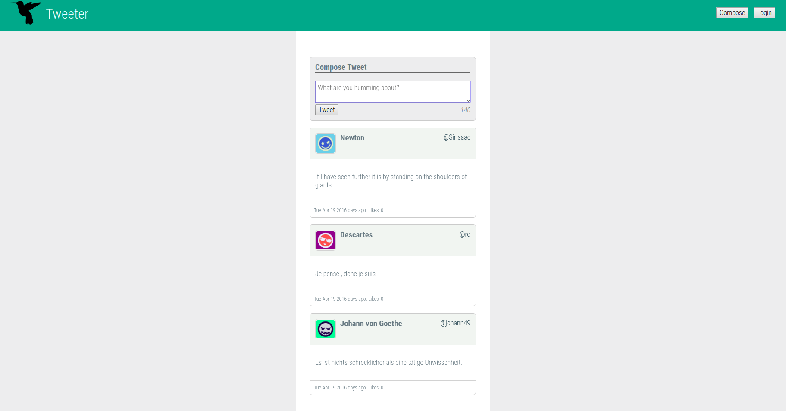

# Tweeter Project

Tweeter is a simple, single-page Twitter clone. Using AJAX techniques, Tweeter dynamically makes HTTP requests without needing a page reload. This creates a seamless user experience. To make data persistent, tweets are saved to a database powered by MongoDB.

Users must log in in order to tweet and like tweets. Of course, users cannot like their own tweets. User data is stored server side and accessed via express-session. To ensure account security, bcrypt handles the password hashing.

#### Tweet Composer

#### List of Tweets

## Getting Started

1. Clone or download this repository.
2. Install dependencies using the `npm install` command.
3. Start the web server using the `npm run local` command. The app will be served at <http://localhost:8080/>.
4. Go to <http://localhost:8080/> in your browser.

## Dependencies

- body-parser
- chance
- express
- md5
- mongodb

## Technologies used

### Frontend
* jQuery

### Backend 
* Node 
* Express 
* MongoDB